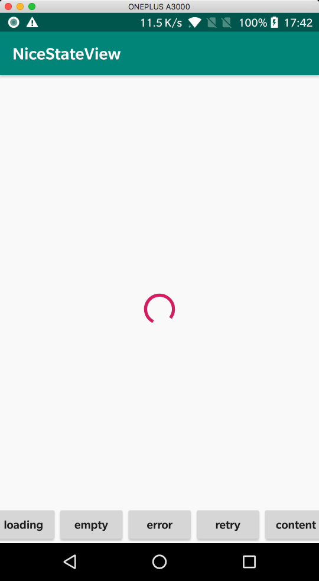
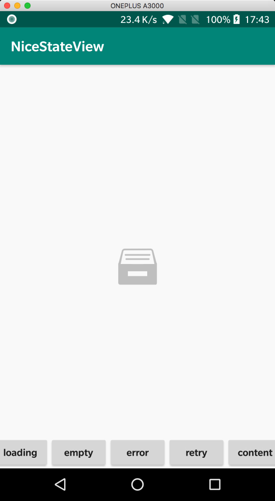
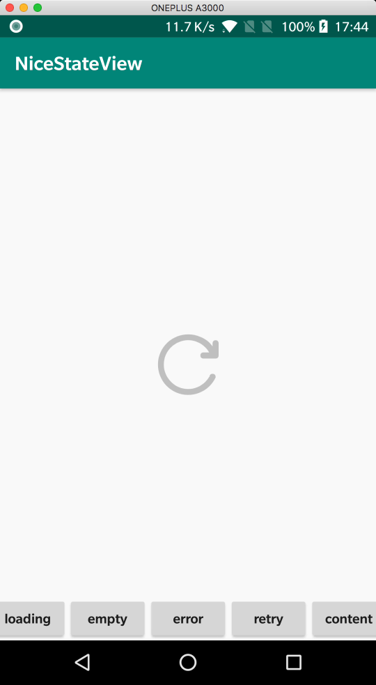

# **[NiceStateView](https://github.com/simplepeng/NiceStateView)**

        

一个超赞的页面状态切换库（加载中，空布局，网络错误，重试，自定义类型）

| Loading | Empty | Error | Retry |
| ------- | ----- | ----- | ----- |
|  |  |  |  |

## 为什么重新造这样一个轮子

gayhub上确实没找到一个适合自己的轮子😢。适合自己的轮子才是好轮子-by 鲁迅

找到的大多数的轮子要么都是将状态页面全部加载出来，然后`visible`，`gone`布局达到状态布局切换的效果。这样做会导致明明已经显示了`content`布局，但其实其他状态布局并没有释放，造成了内存浪费。像用到了一些大的Gif，或者lottie这种库，造成的内存压力可想而知。

要么就是直接`removeView`，`addView`切换布局，这样导致一些特殊的`动画`得不到及时的释放，最后造成`内存泄露`

或者不能`随意插拔替换状态布局`，要知道一个App中可能某些页面的状态布局一些一样的，而有些是不一样的（比如订单页面的空布局和好友列表的空布局）。

但是这个库也有个缺点：那就是会多增加一层`StateLayout`布局做代理布局，但是其实对布局渲染速率没有多大影响。（想想原来没有`ConstraintLayout`的时候，你嵌套了多少层布局 😈）

如果你只在`Recyclerview`中切换状态布局，也可以试试作者的另外一个库：[StateAdapter](https://github.com/simplepeng/StateAdapter) 😁

## 导入依赖

```groovy
implementation 'me.simple:nice-state-view:1.0.3'
```

## 使用默认样式

```kotlin
//初始化注册不同的状态布局
private val niceStateView: NiceStateView by lazy {
        NiceStateView.builder()
            .registerLoading(NiceSampleLoadingView())
            .registerEmpty(NiceSampleEmptyView())
            .registerError(NiceSampleErrorView())
            .registerRetry(NiceSampleRetryView())
            .wrapContent(view_content)//也可以直接wrap Activity和Fragment
    }
...
//切换状态布局
niceStateView.showLoading()
niceStateView.showEmpty()
niceStateView.showError()
niceStateView.showRetry()
niceStateView.showContent()
```

## 设置点击事件

```kotlin
//showLoading()，showEmpty()，showError()，showRetry()都可以设置点击事件
niceStateView.showRetry()
    .setOnViewClickListener(R.id.iv_retry) {
                niceStateView.showLoading()
                view_content.postDelayed({
                    niceStateView.showContent()
                }, 2000)
	}.setOnViewClickListener(R.id.view_retry) {
            toast("view_retry click")
	}
```

## 重设图片和文字

有时候两个页面的状态图样式差不多，只是文字或图片有细微差异，所以在`IStateView`中新增了`setText`，`setImage`等方法。

```kotlin
//所以在showLoading()，showEmpty()，showError()，showRetry()后都可以重设样式
niceStateView.showEmpty()
                .setText(R.id.tv_empty, "这里空空如也~")
                .setImage(R.id.iv_empty, R.drawable.nsv_empty)
```

## 自定义样式

继承`IStateView`类，重写需要用到的方法。

```kotlin
class NiceSampleLoadingView : IStateView() {

    /**
     * 设置填充的布局文件
     */
    override fun setLayoutRes() = R.layout.sample_loading_view

    /**
     * 初始化一些耗时的动画资源
     */
    override fun onAttach(view: View) {
        super.onAttach(view)

    }

    /**
     * 释放一些耗时的动画资源，避免内存泄露
     */
    override fun onDetach(view: View) {
        super.onDetach(view)

    }

}
```

## 注册自定义的Type

```kotlin
NiceStateView.builder()
 .registerCustom(CustomLoginView())
 .wrapContent(view_content)
//
niceStateView.showCustom(CustomLoginView::class.java)
```

## 赞助

如果您觉得`NiceStateView`帮助到了您，可选择精准扶贫，要是`10.24`作者就在这里🙇🙇🙇啦！

您的支持是作者继续努力创作的动力😁😁😁

萌戳下方链接精准扶贫⤵️⤵️⤵️

**[扶贫方式](https://simplepeng.github.io/merge_pay_code/)**

## 技术支持Q群：1078185041


## 版本迭代

* v1.0.3 新增`注册，显示`自定义type的方法
* v1.0.2 fix ConstraintLayout LayoutParams 0dp bug
* v1.0.1 新增`setText`，`setImage`等方法
* v1.0.0 首次上传